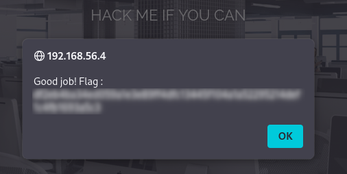

# Cookie Authentication Bypass

## Description
The application uses a cookie named `I_am_admin` to manage user privileges.  
The value observed (`68934a3e9455fa72420237eb05902327`) corresponds to an MD5 hash of `false`.

This suggests that the application relies on client-side data to determine access rights.


## Exploitation
To test this, I modified the cookie value by replacing it with the MD5 hash of `true`:
```text
false : 68934a3e9455fa72420237eb05902327
true : b326b5062b2f0e69046810717534cb09
```

## Impact
- Bypass of authentication  
- Access to admin functionalities  

## Remediation
- Validate user permissions on the server side  
- Avoid trusting client-side data  
- Use secure session handling  

## Conclusion
This issue highlights the risk of relying on client-controlled data for access control. Even if the value is hashed, it can still be modified and reused.


