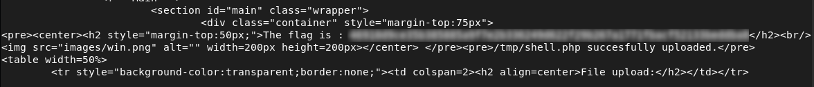

# File Upload Bypass

## Description
During the analysis of the upload feature, I observed that the application only allowed `.jpg` / `.jpeg` files.

However, this validation relied on client-controlled data such as the file extension and MIME type, without verifying the actual file content on the server side.  
This means the application trusts user input to validate uploaded files.


## Exploitation
To test this, I uploaded a PHP file while disguising it as an image by modifying its MIME type:

```bash
curl -X POST "http://192.168.56.4/index.php?page=upload" \
  -F "MAX_FILE_SIZE=100000" \
  -F "uploaded=@/home/user/shell.php;type=image/jpeg" \
  -F "Upload=Upload"
```
The server accepted the file, even though it was not a valid image. This shows that the file validation can be bypassed.


## Impact
- Upload of unauthorized files
- Potential remote code execution


## Remediation
- Validate files on the server side
- Verify the actual file content (not only extension or MIME type)
- Restrict allowed file types
- Store uploaded files in a non-executable directory

  
## Conclusion
This issue highlights the risks of relying only on client-controlled data for file validation. By modifying the MIME type, it was possible to bypass the restriction and upload a malicious file.


