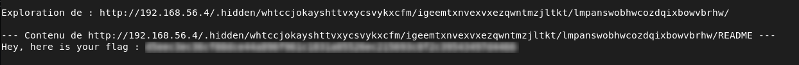

# Hidden Directory Discovery

## Description
The tool `ffuf` was used to discover hidden directories on the web server.

```bash
ffuf -u http://192.168.56.4/FUZZ -w /usr/share/wordlists/dirb/common.txt -fs 975
```

This revealed a `.hidden` folder containing many subfolders, each with a `README` file.

When accessing `http://192.168.56.4/.hidden`, a directory listing is available, showing multiple folders with random names.

## Exploitation

To avoid manually checking each folder, I used a Bash script ([readme_search.sh](../resources/readme_search.sh)) to recursively explore the `.hidden/` directory and read all `README` files.

The script searches for the keyword “flag” and stops when it is found.

Example of the logic used:
```bash
if echo "$content" | grep -qi "flag"; then
    echo "FLAG FOUND"
    exit 0
fi
```
This allowed me to quickly locate the flag.

## Impact
- Hidden directories can be easily discovered
- Sensitive information may be exposed
- Unrestricted access to internal files


## Remediation
- Disable directory listing on the server
- Restrict access to sensitive directories
- Avoid storing sensitive data in publicly accessible locations


## Conclusion

This issue shows that hidden directories are not secure if they are accessible and indexed. Automated tools can easily discover and explore them.


