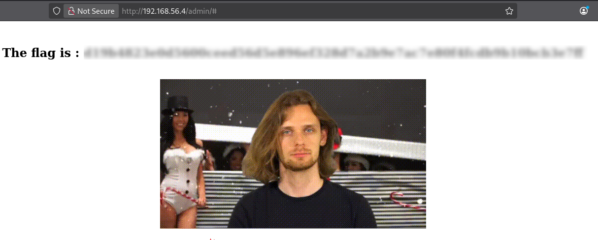

# Directory Enumeration & Credential Exposure

## Description

During the assessment, the `ffuf` tool was used to perform directory brute-forcing against the target web server to identify hidden or unlinked resources.

```bash
ffuf -u http://192.168.56.4/FUZZ -w /usr/share/wordlists/dirb/common.txt
```
This enumeration led to the discovery of two interesting endpoints: `/whatever` and `/admin`.

Accessing `/whatever` revealed that directory listing was enabled, allowing direct visibility of files stored in that directory.
Among them, a file named `htpasswd` was exposed.

## Exploitation

The `htpasswd` file contained the following entry:
```text
root:437394baff5aa33daa618be47b75cb49
```
This value is an MD5 hash for the `root` user. Since MD5 is weak, the hash was cracked, revealing the password.
These credentials were then used to successfully authenticate on the `/admin` endpoint.

## Impact
- Unauthorized access to restricted areas (`/admin`)
- Exposure of sensitive files (`htpasswd`)
- Disclosure of administrator credentials

## Remediation
- Disable directory listing on all web-accessible directories
- Regularly audit exposed endpoints and files
- Use strong, complex passwords for administrative accounts

## Conclusion
This issue demonstrates that exposed directories and weakly protected files can lead to credential compromise and unauthorized access.



