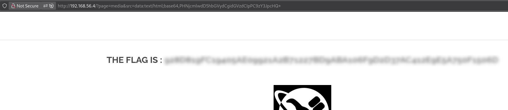

# Cross-Site Scripting (XSS) in Media Page

## Description

The web application provides access to a resource via the following URL:

```html
http://192.168.56.4/?page=media&src=nsa
```

The `src` parameter corresponds to the name of an image displayed inside an `<object>` tag.
However, this value is **not properly validated or escaped on the server side**, allowing for a **Cross-Site Scripting (XSS)** vulnerability.

## Exploitation

An attacker can modify the `src` parameter to inject code.
For example, injecting a script that executes in the victim’s browser via the `<object>` tag:

```Bash
curl 'http://192.168.56.4/?page=media&src=data:text/html;base64,PHNjcmlwdD5hbGVydCgidGVzdCIpPC9zY3JpcHQ+'
```
- `data:text/html` tells the browser to interpret the input as HTML directly.
- Base64 encoding avoids issues with special characters in the URL.

## Impact
- Execution of arbitrary JavaScript in the victim’s browser
- Potential access to sensitive data
- Session hijacking or other malicious actions

## Remediation
- Validate and sanitize all user input on the server side
- Escape special characters before rendering content in HTML

## Conclusion

This vulnerability shows that improper input handling can allow attackers to run scripts in users’ browsers, leading to data exposure or account compromise.


