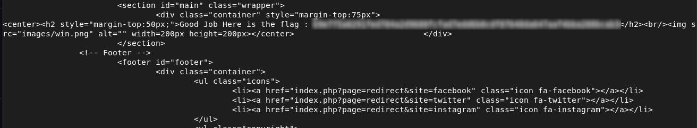

# Open Redirect via site Parameter

## Description

The application uses a `site` parameter to redirect users:

```html
index.php?page=redirect&site=facebook
```
The server trusts the `site` parameter directly, which allows an attacker to modify it and redirect users to arbitrary locations.

## Exploitation

The vulnerability can be tested by modifying the `site` parameter:
```Bash
curl -s "http://192.168.56.4/index.php?page=redirect&site=test"
```
This redirects the user to an unintended location and can expose sensitive information, such as a flag.


## Impact
- Users can be redirected to malicious pages (phishing)
- Sensitive information may be exposed
- Unexpected application behavior
  
## Remediation
- Only allow predefined destinations (whitelist):
```Python
if site not in ["facebook", "twitter", "linkedin"]:
    reject request
```
- Do not use user input directly for redirects
- Return a generic error message for invalid inputs

## Conclusion

This issue demonstrates that trusting user-controlled parameters for redirects can lead to phishing and unintended access to sensitive resources.


