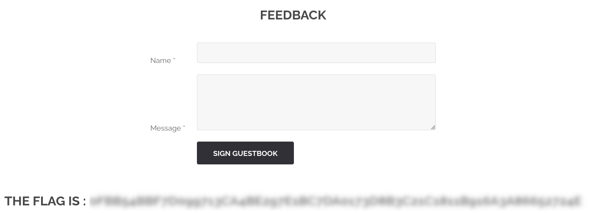

# Stored XSS via Feedback Page

## Description

The feedback page does not properly sanitize user input.  
While `<script>` tags are blocked by the WAF, some HTML tags like `<svg>` are not filtered, allowing stored XSS.


## Exploitation

A working payload:

```html id="p2k8sv"
<svg/onload=alert('XSS')>a
```
This payload executes when the feedback is viewed by another user.

## Impact
- JavaScript can be executed in other users’ browsers
- Sensitive data, including flags, can be exposed


## Remediation
- Sanitize all user inputs before rendering
- Escape HTML characters (e.g., `htmlspecialchars`)
- Filter or remove dangerous tags (`<script>`, `<svg>`, `<iframe>`, etc.)
  
## Conclusion

This vulnerability demonstrates that insufficient input sanitization can allow stored XSS attacks, putting users’ data and sessions at risk.


