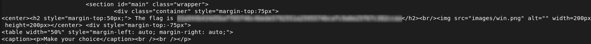

# Survey Input Validation Bypass

## Description

The survey page has a `<select>` field that should only allow values 1–10.  
This restriction is applied **only in the browser**, meaning a user can modify the submitted value using browser DevTools or by intercepting the request.


## Exploitation

Example of sending an out-of-range value:

```bash id="q5y7lz"
curl -X POST "http://192.168.56.4/?page=survey" \
  -d "sujet=2&valeur=42"
```
The server accepted the value, showing that the application trusts client-side validation instead of verifying input on the server.

## Impact
- Users can submit unexpected values
- May cause logical errors or expose sensitive data, including flags
  
## Remediation
- Always validate inputs on the server side
- Reject or sanitize invalid values
- Return an error if submitted data is outside the allowed range


## Conclusion

This issue demonstrates that client-side validation alone is insufficient, and server-side checks are necessary to prevent abuse.



