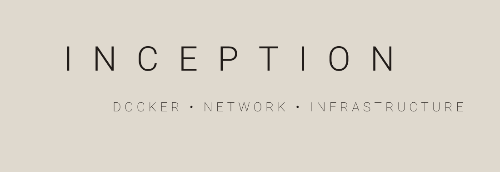

<div align="center">


<br><br>
42 Paris · Inception

</div>

## 01 — Skills Demonstrated

- Docker and Docker Compose  
- Multi-container orchestration  
- Nginx configuration and reverse proxy  
- MariaDB database setup and initialization  
- WordPress deployment and configuration  
- Shell scripting for automation and initialization  
- Linux networking fundamentals  

## 02 — Project Overview

Inception is a project to deploy a **full web stack** using Docker containers:

1. **MariaDB** – Database service with persistent storage  
2. **Nginx** – Web server and SSL reverse proxy  
3. **WordPress** – CMS connected to MariaDB  
4. **SSL** – Self-signed certificates generated automatically  
5. **Automation** – Scripts and Makefile to manage containers and data  

All services are isolated in containers, with proper networking and persistence.

## 03 — Getting Started

### Prerequisites
- Linux
- Docker & Docker Compose installed
- OpenSSL for SSL certificate generation
  
### Build & start the project
```bash
# Start everything and build images
make up
```
This will:
- Create persistent folders for WordPress, MariaDB, and SSL
- Generate a self-signed SSL certificate if it doesn’t exist
- Build and start all containers

### Stop & Clean
```bash
docker-compose down
```
### Example Usage
```bash
# Start project
make up

# Access WordPress container
make access_wordpress

# View logs
make logs

# Stop and clean containers
make down
```
Access WordPress in browser at 
```text 
http://<your-host>:80`
```
